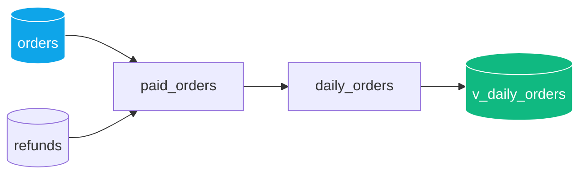

# Tutorial: de una fuente a un resumen con ventana



Construimos un pipeline real, paso a paso, sobre los mismos datos de
`strata/seed.py` (`--seed`): una tabla `orders` con 5 filas (una marcada
`is_test`) y `refunds` con 2 reembolsos. Cada paso agrega código al mismo
archivo; el archivo acumulado se verificó completo contra el CLI real en
cada paso, no solo el fragmento nuevo. Los números que aparecen son la
salida real de `strata run`/`strata test`, no un cálculo hecho a mano.

## Paso 1 — una fuente, un modelo, un filtro

```strata
source orders(ns: "crm", dataset: "orders") {
  columns: {
    order_id:         int64 nonnull,
    customer_id:      int64 nonnull,
    country:          string nonnull,
    gross_amount_usd: money nonnull,
    is_test:          bool,
    order_day:        date nonnull,
  }
}

model paid_orders {
  from orders
  filter coalesce(is_test, false) == false
  let country_code = upper(country)
  select {
    order_id     = order_id,
    country      = country_code,
    gross_amount = gross_amount_usd,
    order_day    = order_day,
  }
}
```

`strata check` en este punto: 1 modelo verde, sin contrato todavía
(`pins (none)`).

## Paso 2 — sumar `refunds` con un join

```strata
source refunds(ns: "crm", dataset: "refunds") {
  columns: {
    order_id:     int64 nonnull,
    discount_usd: money,
    refunded_at:  timestamp,
  }
}

model paid_orders {
  from orders
  join_left refunds on orders.order_id == refunds.order_id
  filter coalesce(orders.is_test, false) == false
  let country_code = upper(orders.country)
  let discount = coalesce(refunds.discount_usd, 0)
  select {
    order_id     = orders.order_id,
    country      = country_code,
    order_day    = orders.order_day,
    gross_amount = orders.gross_amount_usd,
    net_amount   = orders.gross_amount_usd - discount,
  }
}
```

`join_left` deja pasar los pedidos sin reembolso (`discount` cae a `0` vía
`coalesce`); un `join_inner` los habría descartado.

## Paso 3 — fijar el contrato

```strata
contract PaidOrder {
  order_id     : int64 nonnull
  country      : string nonnull enum {ES, MX, CO, BR}
  order_day    : date nonnull
  gross_amount : money nonnull
  net_amount   : money nonnull
}

model paid_orders -> contract PaidOrder {
  # ... mismo cuerpo del paso 2 ...
}
```

`strata check` ahora reporta los pins del contrato:
`paid_orders.country:nonnull+enum{ES,MX,CO,BR}`, etc. Si una fila trajera
un país fuera de `{ES, MX, CO, BR}`, `run` fallaría con `PinError` sin
publicar nada.

## Paso 4 — agregación en un segundo modelo

**Nota importante, encontrada verificando este mismo tutorial**: dentro de
`aggregate { }`, cada salida debe ser o una clave del `group` o una
llamada directa a una función agregada (`sum(...)`, `count(...)`, ...) —
`case(sum(x) >= 100, ...)` NO vale ahí (`E050`), porque no es en sí misma
una llamada agregada aunque contenga una. Y si agregas un `select { }`
*después* de `aggregate { }` en el mismo modelo, con nombres de columna
repetidos, ambos bloques emiten sus columnas — el modelo termina con las
columnas duplicadas en el `SELECT` final y DuckDB lo rechaza
(`Column "orders" ... cannot be referenced before it is defined`). La
forma correcta: la agregación pura en su propio modelo, y cualquier
columna derivada de la agregación (`case`, `over(...)`) en un modelo
siguiente que lee al primero.

```strata
contract DailyRevenue {
  country   : string nonnull enum {ES, MX, CO, BR}
  order_day : date nonnull
  orders    : int64 nonnull
  net_total : money nonnull
}

model daily_revenue -> contract DailyRevenue {
  from paid_orders
  group { country, order_day } (
    aggregate { orders = count(order_id), net_total = sum(net_amount) }
  )
  sort { order_day, country }
}
```

## Paso 5 — clasificar y comparar contra el total del país

```strata
contract RevenueSummary {
  country       : string nonnull enum {ES, MX, CO, BR}
  order_day     : date nonnull
  net_total     : money nonnull
  size          : string nonnull
  country_share : money nonnull
}

model revenue_summary -> contract RevenueSummary {
  from daily_revenue
  select {
    country       = country,
    order_day     = order_day,
    net_total     = net_total,
    size          = case(net_total >= cast(150, "money"), "large",
                          net_total >= cast(75, "money"), "medium",
                          "small"),
    country_share = sum(net_total) over (partition_by: [country]),
  }
  sort { order_day, country }
}
```

`money` no es un tipo "numérico" a efectos de comparación (a diferencia de
`int64`/`float64`/`decimal`) — de ahí el `cast(150, "money")` en vez de
comparar contra `150` directo (que da `E051 cannot compare money(USD)
with int64`).

## Paso 6 — un test declarativo

```strata
test revenue_summary {
  expect row_count >= 1
}
```

## El pipeline completo

```strata
source orders(ns: "crm", dataset: "orders") {
  columns: {
    order_id:         int64 nonnull,
    customer_id:      int64 nonnull,
    country:          string nonnull,
    gross_amount_usd: money nonnull,
    is_test:          bool,
    order_day:        date nonnull,
  }
}

source refunds(ns: "crm", dataset: "refunds") {
  columns: {
    order_id:     int64 nonnull,
    discount_usd: money,
    refunded_at:  timestamp,
  }
}

contract PaidOrder {
  order_id     : int64 nonnull
  country      : string nonnull enum {ES, MX, CO, BR}
  order_day    : date nonnull
  gross_amount : money nonnull
  net_amount   : money nonnull
}

model paid_orders -> contract PaidOrder {
  from orders
  join_left refunds on orders.order_id == refunds.order_id
  filter coalesce(orders.is_test, false) == false
  let country_code = upper(orders.country)
  let discount = coalesce(refunds.discount_usd, 0)
  select {
    order_id     = orders.order_id,
    country      = country_code,
    order_day    = orders.order_day,
    gross_amount = orders.gross_amount_usd,
    net_amount   = orders.gross_amount_usd - discount,
  }
}

contract DailyRevenue {
  country   : string nonnull enum {ES, MX, CO, BR}
  order_day : date nonnull
  orders    : int64 nonnull
  net_total : money nonnull
}

model daily_revenue -> contract DailyRevenue {
  from paid_orders
  group { country, order_day } (
    aggregate { orders = count(order_id), net_total = sum(net_amount) }
  )
  sort { order_day, country }
}

contract RevenueSummary {
  country       : string nonnull enum {ES, MX, CO, BR}
  order_day     : date nonnull
  net_total     : money nonnull
  size          : string nonnull
  country_share : money nonnull
}

model revenue_summary -> contract RevenueSummary {
  from daily_revenue
  select {
    country       = country,
    order_day     = order_day,
    net_total     = net_total,
    size          = case(net_total >= cast(150, "money"), "large",
                          net_total >= cast(75, "money"), "medium",
                          "small"),
    country_share = sum(net_total) over (partition_by: [country]),
  }
  sort { order_day, country }
}

test revenue_summary {
  expect row_count >= 1
}
```

## Corrida real

```
$ python -m strata run tutorial.strata --seed -o tutorial.duckdb
  materialized  v_paid_orders  (4 rows)
  materialized  v_daily_revenue  (3 rows)
  materialized  v_revenue_summary  (3 rows)
  ...
$ python -m strata test tutorial.strata -o tutorial.duckdb
  ok  revenue_summary: row_count >= 1 (got 3)
```

```python
import duckdb
con = duckdb.connect("tutorial.duckdb")
con.execute("SELECT * FROM v_revenue_summary ORDER BY order_day, country").fetchall()
# [('ES', date(2026, 9, 1), Decimal('200.00'), 'large', Decimal('200.00')),
#  ('BR', date(2026, 9, 2), Decimal('70.00'),  'small', Decimal('70.00')),
#  ('MX', date(2026, 9, 2), Decimal('200.00'), 'large', Decimal('200.00'))]
```

Verificación a mano: el pedido 5 (CO, `is_test: true`) queda fuera desde
el paso 1. ES del 2026-09-01 son los pedidos 1 (120.00, sin reembolso) y 2
(90.00, reembolso 10.00 → neto 80.00): `net_total = 200.00`, `"large"`.
BR del 2026-09-02 es el pedido 4 (75.50, reembolso 5.50 → neto 70.00):
`"small"`. MX del 2026-09-02 es el pedido 3 (200.00, sin reembolso):
`"large"`. `country_share` de ES y MX coincide con su propio `net_total`
porque cada país solo tiene una fila en este dataset de demostración — con
más días por país se vería la suma acumulada real.

## De paso: dos bugs reales que esto destapó

Escribir y correr este tutorial de punta a punta (no solo `strata check`)
encontró dos bugs reales en `strata test`, ya corregidos:

1. `strata test` fallaba siempre con `NameError: name 'duckdb' is not
   defined` (import faltante en `cmd_test`, `strata/cli.py`).
2. `expect row_count >= N` (cualquier operador que no fuera `==`) se
   evaluaba como igualdad exacta, ignorando el operador escrito
   (`strata/exec.py::run_tests`).

Cobertura de regresión: `tests/test_declarative_tests.py`.

## Siguientes pasos

- `docs/syntax-reference.md`: cada construcción del lenguaje, por separado.
- `docs/join-cardinality.md`, `docs/incremental.md`,
  `docs/json-arrays.md`, `docs/setops.md`, `docs/nested-domains.md`,
  `docs/§2-warehouse-semantics.md`: features que este tutorial no cubrió
  (cardinalidad de joins, incrementalidad real, JSON/arrays, set-ops,
  tipos anidados, freshness/partitioning).
