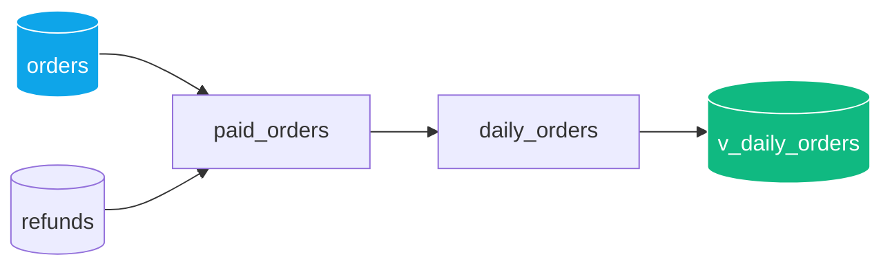

# Tutorial: from a source to a windowed summary



We build a real pipeline, step by step, over the same data from
`strata/seed.py` (`--seed`): an `orders` table with 5 rows (one marked
`is_test`) and `refunds` with 2 refunds. Each step adds code to the same
file; the accumulated file was verified in full against the real CLI at
each step, not just the new fragment. The numbers that appear are the
actual output of `strata run`/`strata test`, not a hand calculation.

## Step 1 — one source, one model, one filter

```strata
source orders(ns: "crm", dataset: "orders") {
  columns: {
    order_id:         int64 nonnull,
    customer_id:      int64 nonnull,
    country:          string nonnull,
    gross_amount_usd: money nonnull,
    is_test:          bool,
    order_day:        date nonnull,
  }
}

model paid_orders {
  from orders
  filter coalesce(is_test, false) == false
  let country_code = upper(country)
  select {
    order_id     = order_id,
    country      = country_code,
    gross_amount = gross_amount_usd,
    order_day    = order_day,
  }
}
```

`strata check` at this point: 1 green model, no contract yet
(`pins (none)`).

## Step 2 — add `refunds` with a join

```strata
source refunds(ns: "crm", dataset: "refunds") {
  columns: {
    order_id:     int64 nonnull,
    discount_usd: money,
    refunded_at:  timestamp,
  }
}

model paid_orders {
  from orders
  join_left refunds on orders.order_id == refunds.order_id
  filter coalesce(orders.is_test, false) == false
  let country_code = upper(orders.country)
  let discount = coalesce(refunds.discount_usd, 0)
  select {
    order_id     = orders.order_id,
    country      = country_code,
    order_day    = orders.order_day,
    gross_amount = orders.gross_amount_usd,
    net_amount   = orders.gross_amount_usd - discount,
  }
}
```

`join_left` lets orders without a refund through (`discount` falls back
to `0` via `coalesce`); a `join_inner` would have discarded them.

## Step 3 — pin the contract

```strata
contract PaidOrder {
  order_id     : int64 nonnull
  country      : string nonnull enum {ES, MX, CO, BR}
  order_day    : date nonnull
  gross_amount : money nonnull
  net_amount   : money nonnull
}

model paid_orders -> contract PaidOrder {
  # ... same body as step 2 ...
}
```

`strata check` now reports the contract's pins:
`paid_orders.country:nonnull+enum{ES,MX,CO,BR}`, etc. If a row brought
in a country outside `{ES, MX, CO, BR}`, `run` would fail with `PinError`
without publishing anything.

## Step 4 — aggregation in a second model

**Important note, found by verifying this very tutorial**: inside
`aggregate { }`, each output must be either a key of the `group` or a
direct call to an aggregate function (`sum(...)`, `count(...)`, ...) —
`case(sum(x) >= 100, ...)` is NOT allowed there (`E050`), because it is
not itself an aggregate call even though it contains one. And if you add
a `select { }` *after* `aggregate { }` in the same model, with repeated
column names, both blocks emit their columns — the model ends up with
duplicated columns in the final `SELECT` and DuckDB rejects it
(`Column "orders" ... cannot be referenced before it is defined`). The
correct shape: pure aggregation in its own model, and any column derived
from the aggregation (`case`, `over(...)`) in a following model that
reads the first one.

```strata
contract DailyRevenue {
  country   : string nonnull enum {ES, MX, CO, BR}
  order_day : date nonnull
  orders    : int64 nonnull
  net_total : money nonnull
}

model daily_revenue -> contract DailyRevenue {
  from paid_orders
  group { country, order_day } (
    aggregate { orders = count(order_id), net_total = sum(net_amount) }
  )
  sort { order_day, country }
}
```

## Step 5 — classify and compare against the country total

```strata
contract RevenueSummary {
  country       : string nonnull enum {ES, MX, CO, BR}
  order_day     : date nonnull
  net_total     : money nonnull
  size          : string nonnull
  country_share : money nonnull
}

model revenue_summary -> contract RevenueSummary {
  from daily_revenue
  select {
    country       = country,
    order_day     = order_day,
    net_total     = net_total,
    size          = case(net_total >= cast(150, "money"), "large",
                          net_total >= cast(75, "money"), "medium",
                          "small"),
    country_share = sum(net_total) over (partition_by: [country]),
  }
  sort { order_day, country }
}
```

`money` is not a "numeric" type for comparison purposes (unlike
`int64`/`float64`/`decimal`) — hence the `cast(150, "money")` instead of
comparing against `150` directly (which gives `E051 cannot compare money(USD)
with int64`).

## Step 6 — a declarative test

```strata
test revenue_summary {
  expect row_count >= 1
}
```

## The complete pipeline

```strata
source orders(ns: "crm", dataset: "orders") {
  columns: {
    order_id:         int64 nonnull,
    customer_id:      int64 nonnull,
    country:          string nonnull,
    gross_amount_usd: money nonnull,
    is_test:          bool,
    order_day:        date nonnull,
  }
}

source refunds(ns: "crm", dataset: "refunds") {
  columns: {
    order_id:     int64 nonnull,
    discount_usd: money,
    refunded_at:  timestamp,
  }
}

contract PaidOrder {
  order_id     : int64 nonnull
  country      : string nonnull enum {ES, MX, CO, BR}
  order_day    : date nonnull
  gross_amount : money nonnull
  net_amount   : money nonnull
}

model paid_orders -> contract PaidOrder {
  from orders
  join_left refunds on orders.order_id == refunds.order_id
  filter coalesce(orders.is_test, false) == false
  let country_code = upper(orders.country)
  let discount = coalesce(refunds.discount_usd, 0)
  select {
    order_id     = orders.order_id,
    country      = country_code,
    order_day    = orders.order_day,
    gross_amount = orders.gross_amount_usd,
    net_amount   = orders.gross_amount_usd - discount,
  }
}

contract DailyRevenue {
  country   : string nonnull enum {ES, MX, CO, BR}
  order_day : date nonnull
  orders    : int64 nonnull
  net_total : money nonnull
}

model daily_revenue -> contract DailyRevenue {
  from paid_orders
  group { country, order_day } (
    aggregate { orders = count(order_id), net_total = sum(net_amount) }
  )
  sort { order_day, country }
}

contract RevenueSummary {
  country       : string nonnull enum {ES, MX, CO, BR}
  order_day     : date nonnull
  net_total     : money nonnull
  size          : string nonnull
  country_share : money nonnull
}

model revenue_summary -> contract RevenueSummary {
  from daily_revenue
  select {
    country       = country,
    order_day     = order_day,
    net_total     = net_total,
    size          = case(net_total >= cast(150, "money"), "large",
                          net_total >= cast(75, "money"), "medium",
                          "small"),
    country_share = sum(net_total) over (partition_by: [country]),
  }
  sort { order_day, country }
}

test revenue_summary {
  expect row_count >= 1
}
```

## Real run

```
$ python -m strata run tutorial.strata --seed -o tutorial.duckdb
  materialized  v_paid_orders  (4 rows)
  materialized  v_daily_revenue  (3 rows)
  materialized  v_revenue_summary  (3 rows)
  ...
$ python -m strata test tutorial.strata -o tutorial.duckdb
  ok  revenue_summary: row_count >= 1 (got 3)
```

```python
import duckdb
con = duckdb.connect("tutorial.duckdb")
con.execute("SELECT * FROM v_revenue_summary ORDER BY order_day, country").fetchall()
# [('ES', date(2026, 9, 1), Decimal('200.00'), 'large', Decimal('200.00')),
#  ('BR', date(2026, 9, 2), Decimal('70.00'),  'small', Decimal('70.00')),
#  ('MX', date(2026, 9, 2), Decimal('200.00'), 'large', Decimal('200.00'))]
```

Manual verification: order 5 (CO, `is_test: true`) has been out since
step 1. ES on 2026-09-01 is orders 1 (120.00, no refund) and 2
(90.00, refund 10.00 → net 80.00): `net_total = 200.00`, `"large"`.
BR on 2026-09-02 is order 4 (75.50, refund 5.50 → net 70.00):
`"small"`. MX on 2026-09-02 is order 3 (200.00, no refund):
`"large"`. ES's and MX's `country_share` matches its own `net_total`
because each country only has one row in this demo dataset — with
more days per country you would see the real accumulated sum.

## Incidentally: two real bugs this uncovered

Writing and running this tutorial end to end (not just `strata check`)
found two real bugs in `strata test`, already fixed:

1. `strata test` always failed with `NameError: name 'duckdb' is not
   defined` (missing import in `cmd_test`, `strata/cli.py`).
2. `expect row_count >= N` (any operator other than `==`) was
   evaluated as exact equality, ignoring the written operator
   (`strata/exec.py::run_tests`).

Regression coverage: `tests/test_declarative_tests.py`.

## Next steps

- `docs/syntax-reference.md`: each language construct, one at a time.
- `docs/join-cardinality.md`, `docs/incremental.md`,
  `docs/json-arrays.md`, `docs/setops.md`, `docs/nested-domains.md`,
  `docs/§2-warehouse-semantics.md`: features this tutorial didn't cover
  (join cardinality, real incremental processing, JSON/arrays, set-ops,
  nested types, freshness/partitioning).
